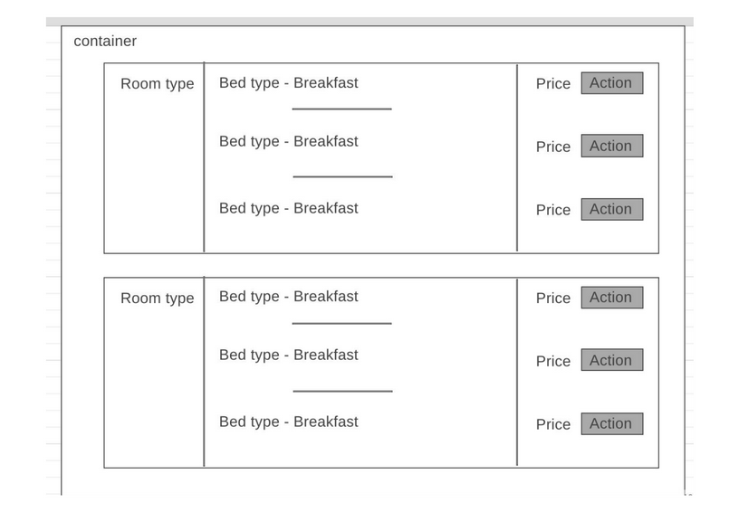

We want to show our users who are trying to Book a hotel room, the various Room Types/Options they can choose from
in a modular way. a Create a simple UI to Display all the different room types grouped by various Room types, as per the
design in the wireframe shown in the bottom of this document.
The goal is to read the attached JSON input file and then create a web page that will:
* Group the various rooms by room types first and Display each room type in its own ‘block’
* Show the the various options the room type comes with inside the block assigned for the room type
* The various options by which the room types can be sub-grouped into are: Bed Type,​ Breakfast
* Display the appropriate price and show an Action button.
The following are the Key Parameters in each Node of the JSON input they need to look at for extracting various values:

* `roomTypeLabel`: for getting the Room Type
* `bedTypeLabel`: for finding out the Bed Type in the room(ex: Double, Twin etc.).
* `boardCodeDescription`: for getting the info about if the Room comes with Breakfast option or not
* `totalPrice`: for getting the price of the room

You can choose a Frontend framework of your choice[like REACT, VUE, ANGULAR etc.]

#Optional task:
 [completing this will get special consideration]: Add functionality to send all the details about the options the room type has when the user clicks on it, to a logging component or a parent display component 

